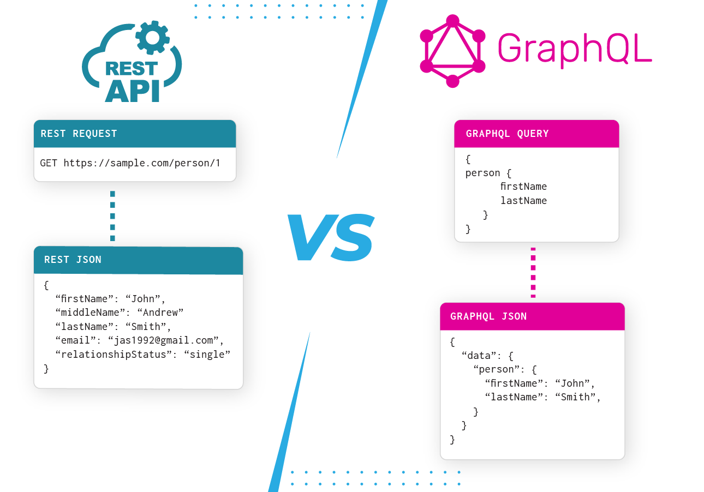

# Learning GraphQL with Apollo and MongoDB

This project is designed to help you learn about GraphQL, Apollo, MongoDB, and how to connect them to build powerful, data-driven applications. By the end of this project, you should be able to explain the following concepts without the help of Google.

## Learning Objectives

1. **What GraphQL Means:**
   - GraphQL is a query language for your API and a server-side runtime for executing those queries. Unlike REST, which exposes a fixed set of endpoints, GraphQL allows clients to request only the data they need, making it highly flexible and efficient.

2. **What is Graphiql:**
   - Graphiql is an interactive, in-browser GraphQL IDE that makes it easy to explore your GraphQL schema and test queries. It provides a user-friendly interface for interacting with your GraphQL server.

   ```graphql
   # Example GraphQL Query in Graphiql
   {
     user(id: 123) {
       id
       name
       email
     }
   }
   ```

3. **How to Test Queries Using Graphiql:**
   - You can use Graphiql to interactively test GraphQL queries against your server. Open Graphiql in your web browser and start writing and executing queries to retrieve data.

4. **What is Apollo:**
   - Apollo is a comprehensive platform for building, delivering, and consuming GraphQL APIs. It offers a wide range of tools and libraries for both the client and server sides of GraphQL applications.

5. **How to Connect to MongoDB:**
   - MongoDB is a NoSQL database that can be integrated with GraphQL applications. You'll learn how to set up a connection to MongoDB, interact with data, and perform CRUD operations.

6. **How to Make Queries from React:**
   - You'll explore how to make GraphQL queries from a React application using Apollo Client. This involves sending GraphQL queries to the server, receiving data, and rendering it in your React components.
   
```
   // Example GraphQL Query in React with Apollo Client
import { useQuery } from '@apollo/client';
import { GET_USER } from './queries';

const UserProfile = () => {
  const { loading, error, data } = useQuery(GET_USER, {
    variables: { userId: 123 },
  });

  if (loading) return 'Loading...';
  if (error) return `Error! ${error.message}`;

  const user = data.user;
  return <div>{user.name}</div>;
};

```

7. **How to Make the GraphQL Server Accept Requests from Another Server:**
   - You'll understand how to configure and secure your GraphQL server to accept requests from other servers. This may involve handling authentication and authorization.

This project is designed to provide hands-on experience and practical knowledge about GraphQL, Apollo, MongoDB, and how to integrate them to build efficient and data-driven applications. As you work through the project, you'll gain a solid understanding of these concepts and their real-world applications.
